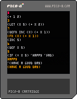

# Into to Pico8lisp

Pico8lisp is a small lisp interpreter built on PICO-8 virtual machine!
To start the interactive programming environment: `load picolisp.pb` then start a shell with `Command (⌘)-R`

The shell is currently inflexible. If your environment crashes, restart it with `Command (⌘)-R`

# Getting Started

Try out Pico8Lisp on the Pico8 Website [here](https://www.lexaloffle.com/bbs/?pid=96658#p)

[!](https://www.lexaloffle.com/bbs/?pid=96658#p)

# Language Specification:
## Literals
### Numbers
Literal numbers are just the numbers themselves.

`123`
> `123`

### Symbols
Symbols are used as names for forms/functions/constants/just about anything. Symbols can be written as series of letters `a-z`. More on that later.

### Nil
Nil can be written as `nil`

`nil`
> `()`

Note that `nil` evaluated to an empty list `()`. That's because the symbol `nil` is bound to the empty list. This is the only false value in picolisp!

### Boolean
Everything except `nil` is true.
But we do have a special value to represent truth.

`$t`
> `$t`

## You can write expressions
The first element of a list is assumed to be a function.

`(+ 1 2)`
> `3`

You can even nest list expressions.

`(+ (+ 1 2) 3)`
> `6`

At the moment, we only have `+`.
## Clear screen
If your repl gets confusing, clear the screen
`(clear)`

## Lists
You can write a list literal with the quote function.

`(quote (1 2 3))`
> `(1 2 3)`

Quote prevents the list from being evaluated!

There is a special quote operator to make this to read.

`'(1 2 3)`
> `(1 2 3)`

## Symbols
By default symbols are evaluated, but you can prevent that with quote.

`'mysymbol`
> `mysymbol`

## Def
You can define global symbols with a value.

`(def age 38)`
> `38`

`age`
> `38`

## local bindings
While `def`s are globally available, you can make locally scoped definitions with `let`

`(let (x 3 y 2) (+ x y))`
> `5`

## You can define functions
Use `defn` to make a function globally accessible.

`(defn inc (x) (+ x 1))`
> `(fn (x) (+ x 1))`

`(inc 2)`
> `3`

You can also define a lambda using `fn`.

`((fn (x) (+ x 1)) 3)`
> `4`

## If statements
Branches are supported by `if` statements.

`(if (= 1 1) 'happy 'sad)`
> `happy`

`(if (= 1 2) 'happy 'sad)`
> `sad`

If else if..., else statements are supported via `cond`

`(def x 1)`

`(cond (= x 0) `one (= x 1) `one)`
> `one`

