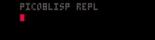

# Into to Pico8lisp

[![CC BY 4.0][cc-by-shield]][cc-by]

Pico8lisp is a small lisp interpreter built on PICO-8 virtual machine!

The shell is currently inflexible. Parse errors typically crash or exhaust memory.
If your environment crashes, reload the page to reset.

# Try it out!

Try out Pico8Lisp on the Pico8 Website [here](https://www.lexaloffle.com/bbs/?pid=96658#p)

[](https://www.lexaloffle.com/bbs/?pid=96658#p)

Using the repl.

You can type commands directly into the shell.
```
> (+ 1 2)
  3
```

`<return>` submits the command.

Press up and down to scroll through your command history.

Press left and right to move the cursor.

`<backspace>` will remove the character to the left of the cursor.

`<shift>-d` will remove the character to the right of the cursor.

Toggle between insert and replace modes by pressing `<shift>-I`.

 

# Language Specification:
## Literals
### Numbers
Literal numbers are just the numbers themselves.

```
> 123
  123
```
### Symbols
Symbols are used as names for forms/functions/constants/just about anything. Symbols can be written as series of letters a-z. More on that later.

### Nil
Nil can be written as `nil`

```
> nil
  ()
```

Note that nil evaluated to an empty list (). That's because the symbol nil is bound to the empty list. This is the only false value in picolisp!

### Boolean

Everything except nil is true.
But we do have a special value to represent truth.

```
> $t
  $t
```

## Expressions

### Calling Functions

The first element of a list is assumed to be a function.

```
> (+ 1 2)
  3
```
You can even nest list expressions.

```
> (+ (+ 1 2) 3)
  6
```

At the moment, we only have +.

### Clear screen
If your repl gets confusing, clear the screen

```
(clear)
```

### Lists

You can write a list literal with the `quote` function.

```
> (quote (1 2 3))
  (1 2 3)
```

Quote prevents the list from being evaluated!

There is a special quote operator to make this to read.

```
> '(1 2 3)
  '(1 2 3)
```

There are many functions which work with lists
```
> (empty? ())
  $t
> (len '(1 2 3))
  3
> (first '(1 2 3))
  1
> (second '(1 2 3))
  2
> (nth 2 '(1 2 3))
  3
> (rest '(1 2 3))
  (2 3)
> (reverse '(1 2 3))
  (3 2 1)
> (reduce + 0 '(1 2 3 4))
  10
> (map inc '(1 2 3))
  (2 3 4)
> (filter (fn (x) (= x 1)) '(1 2))
  (1)
```
### Symbols

By default symbols are evaluated, but you can prevent that with quote.

```
> 'mysymbol
  mysymbol
```

### Def
You can define global symbols with a value.

```
> (def age 38)
  38

> age
  38
```

### local bindings
While def symbols are globally available, you can make locally scoped definitions with let

```
> (let (x 3 y 2) (+ x y))
  5
```

### You can define functions
Use defn to make a function globally accessible.

```
> (defn inc (x) (+ x 1))
  (fn (x) (+ x 1))

> (inc 2)
  3
```

### If statements
Branches are supported by if statements.

```
> (if (= 1 1) 'happy 'sad)
  happy
> (if (= 1 2) 'happy 'sad)
  sad
```

If else if..., else statements are supported via cond

```
> (def x 1)
> (cond (= x 0) 'zero (= x 1) 'one $t 'other)
  one
```

`and` and `or` are also supported.

```
`> (and nil 1)
  ()
> (or nil 1)
  $t
```

# License

This work is licensed under a
[Creative Commons Attribution 4.0 International License][cc-by].

[![CC BY 4.0][cc-by-image]][cc-by]

[cc-by]: http://creativecommons.org/licenses/by/4.0/
[cc-by-image]: https://i.creativecommons.org/l/by/4.0/88x31.png
[cc-by-shield]: https://img.shields.io/badge/License-CC%20BY%204.0-lightgrey.svg


